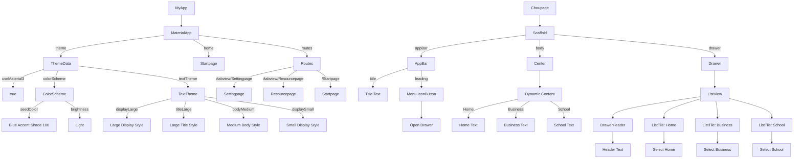

# 1.Project Mission

在从2023年到现在2025年，两年内AI迎来爆发式发展，最初从NewBing引爆第一次AI讨论，而后的ChatGPT4，再到现在我国的DeepSeek.无论是否认可，AI时代已经到来。随之而来的就是关于在AI新时代下，我们怎么自学？怎么合理、高效的自学？本次项目便是我们团队对这个问题的答案

## Getting Started

This project is a starting point for a Flutter application.

A few resources to get you started if this is your first Flutter project:

- [Lab: Write your first Flutter app](https://docs.flutter.dev/get-started/codelab)
- [Cookbook: Useful Flutter samples](https://docs.flutter.dev/cookbook)

For help getting started with Flutter development, view the
[online documentation](https://docs.flutter.dev/), which offers tutorials,
samples, guidance on mobile development, and a full API reference

